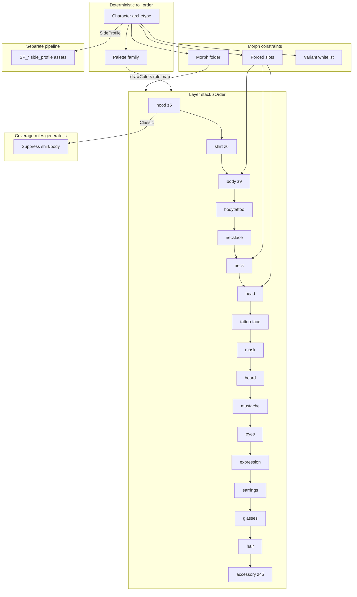

# Chromies Component Library Audit

**Source:** `art-pipeline/components` (353 files, 337 PNG layers)  
**Cross-reference:** `art-pipeline/traits.json`, `art-pipeline/chromies-config.js`, `art-pipeline/generate.js`  
**Machine-readable data:** `chromies-engine/reports/components_full_report.json`  
**No artwork was modified.**

---

## Executive summary

The canonical library is a **character-gated, slot-based, role-recoloring** system—not the abstract head-shape / mask-type / forehead-mark model in `chromies-engine`. It already powers `generate.js` with 17 compositing slots, 9+ character archetypes, and ~80 palette variants. Roughly **29% of PNGs are side-profile (`SP_`) layers** for a separate render mode. **Hard constitution rules** (forehead mark layer, mask families, 8 palette families) are not embodied in the file set; the engine should adapt to this library, not vice versa.

---

## 1. Complete asset inventory

| Metric | Count |
|--------|------:|
| Total files | 353 |
| PNG layers | 337 |
| 64×64 PNG | 335 |
| Non-64×64 | 2 (legendary Normie exports @ 640×640) |
| Empty `*_None.png` layers | 16 |
| Aseprite / GPL sources | 16 |
| Referenced in `traits.json` | 308 paths |
| Missing on disk (traits.json) | 8 SP_ paths |
| Duplicate pixel groups | 13 |
| Exact mirror pairs (flip=other file) | 0 |

### Folder layout (body morph / render context)

| Folder | Files | Role |
|--------|------:|------|
| *(root)* | 70 | Default HeroA-adjacent shared layers |
| `female/` | 57 | Female morph variants |
| `Chubby/` | 45 | Combined torso+shirt chubby morph |
| `male/` | 45 | Male HeroA slot variants |
| `SideProfile_Female/` | 35 | Side-view female |
| `SideProfile_Male/` | 35 | Side-view male |
| `sideprofile/` | 29 | Legacy side-profile path |
| `legendary/` | 15 | 1/1 Normie-adjacent finals + sources |
| `zombie/` | 15 | Zombie morph |
| `alien/` | 4 | Alien morph |
| `Agent/` | 3 | Agent morph |

### Category breakdown (from filename + folder heuristics)

| Category | Count | Example paths |
|----------|------:|---------------|
| side_profile | 99 | `SideProfile_Male/SP_HAIR_Afro_Male.png` |
| hair | 42 | `HAIR_Afro.png`, `male/HAIR_Male_Mohawk.png` |
| neck_accessory | 28 | `NECKLACE_Chain.png`, `NECK_HeroA.png` |
| glasses | 27 | `GLASSES_Shades.png`, `GLASSES_Chubby_VR.png` |
| eyes | 25 | `EYES_Signal.png`, `female/EYES_Female_Stoned.png` |
| tattoo (face) | 24 | `TATTOO_Scar.png`, `TATTOO_Normies.png` |
| expression | 20 | `EXPRESSION_Neutral.png` |
| head | 10 | `male/HEAD_HeroA.png`, `Chubby/HEAD_Chubby.png` |
| hood | 10 | `HOOD_Classic.png`, `zombie/HOOD_Zombie_Hooded.png` |
| body | 9 | `male/BODY_Default.png`, `alien/BODY_Alien.png` |
| beard | 9 | `BEARD_Full.png`, `male/BEARD_Male_Goat.png` |
| normie_reference | 9 | `legendary/NORMIE_4354_Serc.png` |
| mustache | 8 | `MUSTACHE_Thick.png` |
| accessory | 6 | cigarette variants |
| clothing_shirt | 6 | `male/SHIRT_Crew.png` |
| earrings | 4 | `EARRINGS_Stud.png` |
| mask | 1 | **`MASK_None.png` only** |
| palette | 1 | `legendary/Chimp.gpl` |

### Per-asset signals (typical 64×64 front layer)

- **Transparency:** all PNGs RGBA; **0 partial-alpha** pixels detected (constitution-safe).
- **Palette:** 6–18 distinct RGB colors per layer (hand-authored banding).
- **Opacity:** active layers ~150–2,400 opaque pixels; `*_None` = 0.
- **Anchors (mean bbox):** body/shirt feet_y≈63; head top_y≈8; eyes center_y≈25; hair top_y≈5; center_x≈31–32.

Full per-file records: `components_full_report.json` → `inventory`.

---

## 2. Proposed taxonomy

Replace abstract forge categories with **art-native** taxonomy:

```
CharacterArchetype / RenderMode / Slot / Variant
```

### Tier A — Character archetype (top roll, from `chromies-config.js`)

`HeroA` · `Chubby` · `Alien` · `Cat` · `Zombie` · `Agent` · `SideProfile` · `Legendary`

Each archetype defines: forced slots, palette pool, variant whitelist, gender.

### Tier B — Render mode

| Mode | Asset prefix | Count |
|------|--------------|------:|
| `front` | *(no SP_)* | ~238 |
| `side_profile` | `SP_` | 99 |

### Tier C — Compositing slot (from `traits.json`)

`hood` → `shirt` → `body` → `bodytattoo` → `necklace` → `neck` → `head` → `tattoo` → `mask` → `beard` → `mustache` → `eyes` → `expression` → `earrings` → `glasses` → `hair` → `accessory`

(zOrder 5–45 documented in traits.json)

### Tier D — Morph folder

`root` | `male` | `female` | `Chubby` | `zombie` | `alien` | `Agent` | `SideProfile_*`

### Tier E — Palette (runtime recolor, not baked into most layers)

Base: SIGNAL, ACID, CYAN, GHOST, BLOOD, MOSS + hair tints + shirt colors + special CAT/ALIEN/ZOMBIE/AGENT/GOLD/NORMIE_* 

---

## 3. Dependency graph



**Hard dependencies observed in art + config:**

- `HeroA` → forced `head` + `neck` (same hero silhouette).
- `Chubby` → forced `head` + `body` (torso+shirt combined); `shirt` = None only.
- `HeroA Female` → forced `head` + `neck` + `body` = Female.
- `hood=Classic` → suppresses shirt/body layers at render time.
- Side-profile assets **never compose with front `HEAD_*`** (different anchor stats).

---

## 4. Recommended trait schema (art-derived)

**Recommend replacing** `chromies-engine/traits/rarity.json` head_shape/mask_type taxonomy **for production compositing** with:

```json
{
  "character_archetype": "HeroA | Chubby | Alien | Cat | Zombie | Agent | SideProfile | Legendary",
  "gender": "Male | Female | Neutral",
  "render_mode": "front | side_profile",
  "palette": "<from chromies-config PALETTES>",
  "slots": {
    "hood": "...",
    "shirt": "...",
    "body": "...",
    "bodytattoo": "...",
    "necklace": "...",
    "neck": "...",
    "head": "...",
    "tattoo": "...",
    "mask": "...",
    "beard": "...",
    "mustache": "...",
    "eyes": "...",
    "expression": "...",
    "earrings": "...",
    "glasses": "...",
    "hair": "...",
    "accessory": "..."
  }
}
```

Keep **Identity DNA** (`temperament`, `origin_signal`, etc.) as a **parallel metadata stream**—the art library does not encode it.

**Forehead mark:** no `MARK_*` assets exist. Recommend mapping constitution mark to:
- primary: new `mark/` slot (future art), or
- interim: designated `tattoo` variants (`Signal`, `Marks`, `Pyramid`) + validator exception table per character.

---

## 5. Compatibility matrix (archetype × slot)

| Slot | HeroA M | HeroA F | Chubby | Alien | Cat | Zombie | Agent | SideProfile |
|------|---------|---------|--------|-------|-----|--------|-------|-------------|
| head | forced HeroA | forced HeroA_F | forced Chubby | Alien head | Cat | Zombie | Agent | SP head only |
| neck | forced | forced | N/A | Alien | — | Zombie | Agent | SP neck |
| body | Default/Tank | Female | **combined** | Alien | — | Zombie | Agent | SP body |
| shirt | Crew/Tank | Crew/Tank | **None only** | — | — | — | — | SP shirts |
| hood | Classic/None | Classic/None | Classic/None | — | — | Zombie set | — | SP hood |
| hair | male/* pool | female/* pool | chubby/* only | — | — | zombie/* | — | SP hair |
| eyes | male/* | female/* | chubby/* | Alien | — | zombie | — | SP eyes |
| mask | **None only** | **None only** | **None only** | — | — | — | — | — |
| beard | male/* | female SP | chubby/* | — | — | — | — | SP beard |
| glasses | shared + morph | female/* | chubby/* | — | — | — | — | SP glasses |

**Cross-morph incompatible without re-anchor:** root hair on Chubby head, male eyes on female head, front layers on SideProfile.

---

## 6. Suggested rarity weights

Derive from **`chromies-config.js` CHARACTERS[].weight`** (production truth), not forge placeholders:

| Character | Config weight | ~% of collection |
|-----------|--------------:|-----------------:|
| HeroA Male | 440 | ~44% |
| HeroA Female | 441 | ~44% |
| Chubby | 136 | ~14% |
| Alien / Cat / Zombie / Agent | lower | ~1–3% each |
| SideProfile | separate mode | metadata-only or parallel collection |

**Within-slot weights:** already defined in `traits.json` variant `weight` + character `slotVariantPool` overrides (e.g. hair `None` 5–12%, glasses `None` ~48%).

**Recommend:** import weights verbatim into engine JSON via automated export from `chromies-config.js` + `traits.json`—do not invent parallel rarity tables.

---

## 7. Missing asset categories (vs library + constitution)

| Expected | Status |
|----------|--------|
| Forehead mark layer | **Missing** — no `MARK_*` |
| Mask variants | **Missing** — only `MASK_None.png` |
| chromies-engine head shapes (Taper, Broad, …) | **Missing** — uses Hero heads |
| chromies-engine palette families (Ember, Tide, …) | **Missing** — uses SIGNAL/ACID/… |
| `anchors.json` per head/body | **Missing** — must be measured |
| Front-facing mark clearance in hair | Not designed as separate concern |
| 8 side-profile beard/hair files | Referenced in traits.json **missing on disk** |

---

## 8. Redundant assets

| Group | Files | Notes |
|-------|-------|-------|
| Universal None | 14 paths, **1 identical pixel hash** | Single blank PNG reused—keep one canonical `None.png` |
| BEARD_Full = BEARD_Goat | identical hash | **Bug or placeholder—one should differ** |
| EYES_None = EXPRESSION_None | identical hash | Collapse or split intentionally |
| Cigarette accessory | male/female/chubby | Same pixels—one file + morph path aliases |
| Male/Female Stoned eyes | identical hash | Gender label only; share asset |
| Male/Female WideOpen eyes | identical hash | Share asset |
| HOOD_Classic = female HOOD_Female_Classic | identical hash | Share asset |
| Sideprofile shades triplets | 3 paths | SP_GLASSES_Shades variants duplicate |
| SP hair Afro male/female | duplicate hash | Side-profile mirror of same art |

---

## 9. Constitution violations (in art, not placeholders)

| Rule | Finding |
|------|---------|
| Forehead mark required | **No mark layer**; closest: `TATTOO_Signal`, `BODYTATTOO_Pyramid` |
| Mask identity anchor | **No mask art** |
| Edge buffer (rows/cols 0–1) | **~48 front layers** touch edge pixels |
| Side profile | 99 assets fail front-facing constitution by design |
| Normie similarity risk | `NORMIE_*` palettes, necklaces, tattoos, legendary PNGs in library |
| Naming / identity | Traits named `Normies`, `NORMIE_*` throughout |
| Duplicate beard Full/Goat | Identical pixels—violates visual diversity intent |
| Round-dot eyes + plain head | `EYES_*Stoned`, `WideOpen` on Hero heads—**review face-position similarity** |
| Abstract forge palette | SIGNAL 6-family ≠ constitution 8-family Ember/Tide/… |

---

## 10. Modularity recommendations

### Do first (before engine code changes)

1. **Adopt `traits.json` + `chromies-config.js` as schema source of truth**—export to engine JSON; deprecate hand-written `traits/rarity.json` head/mask tables for compositing.
2. **Add `anchors.json` generator**—batch-measure bbox feet_y, head_top, center_x per `(character, slot, variant)` from existing PNGs.
3. **Normalize paths**—`Chubby/` vs `chubby/` casing; consolidate `sideprofile/` vs `SideProfile_*`.
4. **Deduplicate** universal None + identical gender pairs; fix BEARD_Full/Goat if unintentional.
5. **Quarantine Normie legendary exports** to `reference/` (fingerprints only)—keep out of compositing paths.
6. **Split render modes**—`forge_front` vs `forge_side_profile` pipelines sharing Identity DNA only.

### Engine architecture changes (recommend before implementing)

| Current engine | Art library | Recommendation |
|----------------|-------------|----------------|
| PNG paste, fixed z-order | Role recolor via palette `drawColors` | Port `extractToBuffer` recolor step OR bake palettes per family at export |
| `traits/heads/Taper/base.png` | `male/HEAD_HeroA.png` | Path resolver: `{morph}/{SLOT}_{variant}.png` |
| Abstract mask types | mask slot empty | Drop mask roll until art exists; or map `tattoo`/`expression` |
| 8 palette JSON families | 80+ chromies-config palettes | Import palette definitions from `chromies-config.js` |
| Placeholder procedural art | 335 hand layers | **Remove placeholders** for slotted categories covered by library |
| Identity Strength heuristics | Mark/hair metrics tuned for placeholders | Retrain weights after real composite stats |

### Preserve

- Deterministic PCG64 / seed streams
- Identity DNA separate from appearance
- Review buckets + constitution validators (recalibrate after real composites)
- Normies as negative reference only—**remove Normie-named wearables from generation pool** or flag as blocked traits

---

*Generated by `reports/analyze_components.py`. Re-run after library changes.*
