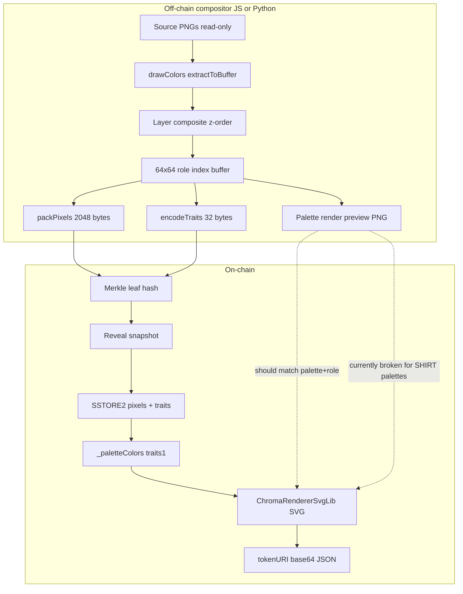

# Renderer Parity Report

**Date:** 2026-07-06  
**Scope:** Python `chromies-engine` compositor vs on-chain mint / `tokenURI` path  
**Status:** Audit only — no code changes  
**Purpose:** Gate mint-data generation until parity gaps are understood and resolved.

---

## Executive Summary

The mint contract does **not** re-compose art from traits at render time. It stores a **pre-composited 4-bit-per-pixel role-index buffer** plus a **32-byte trait payload**, then builds **SVG at `tokenURI` read time** by mapping stored indices through a **hardcoded on-chain palette table** keyed by `traits[1]`.

All **drawColors / clothing recolor logic runs off-chain** (Node `generate.js` or Python `palette_renderer.py`) **before** packing. The contract has no drawColors, no layer stack, and no head/face-family concept.

**Python preview PNGs are not mint payloads.** They are a convenience render of the same role buffer the mint path *should* use, but:

1. Python has **no mint export** (`pixelsHex` / `traitsHex` / pack / encode).
2. **JS golden-file parity is planned but not implemented** (`reports/JS_GOLDEN_PARITY_PLAN.md`).
3. Several pipeline palette and trait encodings **do not exist on-chain**, so even a byte-perfect Python↔JS compositor match could still **diverge from `tokenURI`** for a large share of tokens.

**Face Forge families (Angular / Rugged) are not representable in the mint trait schema** unless their geometry is baked into the pixel buffer using an existing head asset path — there is no on-chain “Face Family” attribute.

---

## 1. What Image Data the Mint Contract Expects

### Inscribe / reveal payload (`Chroma.sol`)

| Field | Size | Format |
|-------|------|--------|
| `pixels` | **2048 bytes** | 4096 pixels × 4 bpp, two nibbles per byte (high nibble = even index) |
| `traits` | **32 bytes** | Packed metadata (see §7) |

Merkle leaf: `keccak256(abi.encodePacked(tokenId, pixels, traits))`.

Flow:

1. **Mint** → placeholder ERC-721 (no image data).
2. **Reveal** → verify merkle proof; store `revealedTraits` snapshot (cheap).
3. **Inscribe** → `ChromaStorage.writeTokenData`; optional canvas bake via `rewritePixels`; token locked.

References:

- `contracts/Chroma.sol` — `PIXELS_LENGTH = 2048`, `TRAITS_LENGTH = 32`
- `contracts/ChromaStorage.sol` — SSTORE2 pixel blob + `bytes32` traits

### Semantic content of `pixels`

Each nibble is a **palette role index** (0–15), not RGB:

| Index | Typical role |
|-------|----------------|
| 0 | background (transparent in composite) |
| 1–8 | skin ramp |
| 9–12 | hood / shirt / structural |
| 13–15 | accent / hair / shirt highlights |

The buffer is the output of **layer compositing** (z-order alpha stack) over per-slot **role-index grids** extracted from source PNGs.

---

## 2. Contract Rendering Model

### What the contract does

```
stored pixels (role indices)
        +
traits[1] → _paletteColors() → 16 hex strings
        +
optional canvas diffs (ChromaCanvasV2)
        ↓
ChromaRendererSvgLib.buildBody() → SVG rects
        ↓
tokenURI → base64 JSON with embedded base64 SVG
```

**Not used at render time:** individual trait slots (hood, shirt, hair, …) for geometry. Those bytes drive **metadata JSON attributes only** (plus palette selection).

### Traits vs pixels

| Approach | Used? |
|----------|-------|
| Live trait recomposition from stored PNGs | **No** |
| Packed pixel buffer | **Yes** — primary image source |
| SVG stored on-chain | **No** — generated in `ChromaRenderer.tokenURI()` |
| Raw RGB / PNG on-chain | **No** |

References:

- `contracts/ChromaRenderer.sol` — `_loadSvgContext`, `_paletteForToken`
- `contracts/ChromaRendererSvgLib.sol` — `_getPixelIndex`, run-length SVG rects (1024×1024, cell=16)

### SVG vs pipeline preview

| | JS `renderSVG` / PNG | On-chain `ChromaRenderer` |
|--|----------------------|---------------------------|
| Canvas size | 1000×1000 | 1024×1024 |
| Cell size | ~15.625px | 16px |
| Pixel source | Live composite buffer | Stored packed pixels |

Visual content should match when the **same role buffer + palette** are used; dimensions differ cosmetically.

---

## 3. drawColors / Clothing Recolor

### Off-chain (pipeline) — **Yes**

Extraction path (JS and Python):

1. Resolve `drawColors` per slot/pick (`resolveExtractionDrawColors`).
2. Map each opaque PNG pixel to nearest authoring hex → **role index** (`extractToBuffer`).
3. Composite layers → 64×64 role buffer.
4. Apply `paletteKey` role→RGB table for preview PNG (`renderPNG` / `render_palette_png`).

`drawColors` sources (priority):

1. Zombie / Agent palette tables (character-specific assets)
2. Variant-level `drawColors`
3. Variant `extractionPalette`
4. Slot default `drawColors`

**Clothing / shirt recolor** is implemented as **palette family selection** (e.g. `SIGNAL_SHIRT_RED` changes role colors in the 16-color table — often index 9 for shirt/hood band) plus variant-level extraction maps. This happens **before** packing.

References:

- `art-pipeline/generate.js` — `resolveExtractionDrawColors`, `extractToBuffer`, `compositeChromie`
- `chromies-engine/engine/palette_renderer.py` — ports same logic

### On-chain — **No**

The contract only implements `_paletteColors(uint8 paletteId)` — a fixed lookup table. No nearest-color extraction, no per-slot drawColors, no shirt variant logic.

**Implication:** Whatever colors appear on-chain are exactly `palette[pixelIndex]` for the palette byte in `traits[1]`. Clothing color correctness depends entirely on encoding the **correct palette byte** at mint-data generation time.

---

## 4. Python Preview PNGs vs `tokenURI` Output

### Intended relationship

Both should represent:

```
role_index_buffer + palette_key → RGB / SVG
```

Python `generate_chromie()` → `composite_chromie()` → `render_palette_png()`.  
On-chain `tokenURI` → stored pixels + `_paletteColors(traits[1])` → SVG.

### Current parity status: **Not verified**

| Check | Status |
|-------|--------|
| Python compositor ↔ JS `generate.js` trait picks | **Unverified** (golden plan only) |
| Python compositor ↔ JS role buffer | **Unverified** |
| Python PNG ↔ JS PNG | **Unverified** |
| JS mint buffer ↔ on-chain SVG | **Partial** — legendary round-trip script exists |
| Python → mint payload | **Not implemented** |

References:

- `chromies-engine/reports/JS_GOLDEN_PARITY_PLAN.md`
- `art-pipeline/verify-legendary-finals.js` — pack/unpack for legendaries only

### Known divergence vectors (even after Python↔JS match)

1. **Palette byte encoding gaps** (§6) — preview uses full palette name; chain may decode a different palette.
2. **SVG dimensions** (1000 vs 1024) — cosmetic.
3. **Canvas diffs** — post-inscribe edits applied only on-chain.
4. **Mutation tier** — documented in older contract docs (`traits[15]` + `_mutatePixelIndex` in generated docs), but **current workspace** `ChromaRendererSvgLib.sol` has **no mutation tier field** and does not mutate pixels at render time. Pipeline sets bytes 15–16 to **0 (retired)** via `bridge-mint-data.js`.

---

## 5. Head / Face Families vs Mint Payload

### How heads work today

- `head` is a **compositor slot** with character-gated variants (`traits.json` + `CHARACTERS` forced slots).
- Head geometry is **rolled or forced** into `render_picks.head`, extracted to a role buffer, and **composited into the pixel blob**.
- **There is no `traits[n]` byte for head shape or face family.**

On-chain metadata lists Character, Palette, Hood, Shirt, Body, … Hair — **not Head**.

### Face Forge (`derived_assets/face_forge/`)

| Asset | In compositor schema? | In mint trait bytes? | Mintable as-is? |
|-------|----------------------|----------------------|-----------------|
| Classic HeroA head | Yes (forced per character) | No (baked in pixels) | Yes |
| Angular v2.1 | **No** | **No** | Only if wired into picks + merkle |
| Rugged v2.1 | **No** | **No** | Only if wired into picks + merkle |

Face Forge modules (`face_forge.py`, `face_forge_v2_1.py`, `face_bakeoff.py`) are **experimental** — they swap head buffers in isolation but are **not registered** in `generate_chromie()` / `bridge-mint-data.js`.

**Conclusion:** Generated head families are **not representable in the trait payload**. They can only appear on-chain if:

1. The derived head PNG is used as the `head` slot source during compositing, and
2. The resulting pixel + trait bytes are what get merkle-committed.

No contract change is required for *visual* support (pixels are opaque), but **metadata will not describe face family**.

---

## 6. Contract Support for New / Derived Assets

| Capability | On-chain support |
|------------|------------------|
| New component PNG | **Indirect** — must be composited off-chain into pixels |
| New trait slot byte | **No** — bytes 19–31 reserved; slots 0–14 schema fixed |
| Face Forge derived heads | **No awareness** |
| `_SHIRT_*` palette families | **Not in** `_paletteColors()` or `ON_CHAIN_PALETTE_BYTES` |
| Normie legendary palettes 28–36 | Bytes defined in `on-chain-character-bytes.js`; **no matching branches** in `_paletteColors()` (fallback / wrong colors) |
| Agent palette 37 | **Supported** in `_paletteColors` |
| Extended hair (AZVet, Buns) | Encoded in JS `HAIR_BYTES` but **not in** `_hairLabel()` |
| Extended eyes (MakeUp, Stoned, …) | Encoded in JS `EYES_BYTES` but **not in** `_eyesLabel()` |
| Extended necklaces | Encoded in JS `NECKLACE_BYTES` but **not in** `_necklaceLabel()` |
| Body Tank / Zombie | Encoded in JS `BODY_BYTES` but **not in** `_bodyLabel()` |
| SideProfile / Chubby character bytes | Stored in `traits[0]` but `_characterLabel()` returns **"Human"** |

### Critical palette encoding gap

Pipeline rolls **`_*_SHIRT_*`** palette families (~60% bucket weight in `pickPalette`). These exist in:

- `art-pipeline/traits.json`
- `art-pipeline/chromies-config.js`
- `chromies-engine/engine_data/art_schema.json`

They are **absent** from:

- `art-pipeline/on-chain-character-bytes.js` (`ON_CHAIN_PALETTE_BYTES`)
- `contracts/ChromaRenderer.sol` (`_paletteColors`)

`bridge-mint-data.js` `encodeTraits()` calls `lookupByte(ON_CHAIN_PALETTE_BYTES, paletteKey, …)` — unknown keys **warn and encode byte 0 (`SIGNAL`)**.

**Effect:** Tokens composed with e.g. `SIGNAL_SHIRT_RED` preview correctly off-chain, but on-chain `tokenURI` renders with base **SIGNAL** palette → **wrong shirt/hood colors** (index 9 and related roles).

This is the largest functional parity break between preview and mint rendering.

---

## 7. Required Mint Exports

### On-chain required (merkle / inscribe)

| Export | Required? | Details |
|--------|-----------|---------|
| **`pixelsHex`** | **Yes** | 2048-byte packed buffer (`0x` + 4096 hex chars) |
| **`traitsHex`** | **Yes** | 32-byte encoded traits (`0x` + 64 hex chars) |
| Merkle proof | **Yes** | Per-token proof against `revealRoot` |

Produced by: `node art-pipeline/bridge-mint-data.js`

Batch outputs:

- `art-pipeline/output/mint-data.json`
- `art-pipeline/output/mint-data.csv`

Encoding details (`bridge-mint-data.js`):

```text
traits[0]  character   ON_CHAIN_CHARACTER_BYTES
traits[1]  palette     ON_CHAIN_PALETTE_BYTES
traits[2]  hood
traits[3]  shirt
traits[4]  body
traits[5]  bodytattoo
traits[6]  necklace
traits[7]  tattoo
traits[8]  mask
traits[9]  beard
traits[10] mustache
traits[11] eyes
traits[12] earrings
traits[13] glasses
traits[14] hair
traits[15–16] retired → 0
traits[17–18] total non-zero nibble count (uint16 BE)
traits[19–31] reserved
```

### Auxiliary (not written to chain as image bytes)

| Export | Role |
|--------|------|
| **PNG** | Pre-reveal marketing, internal QA, IPFS optional — **not** inscribed image format |
| **Metadata JSON** | Off-chain `revealedBaseURI` before inscription; on-chain JSON is **generated** by renderer |
| **SVG** | Never stored; computed at `tokenURI` |
| **Raw 4096-byte unpacked buffer** | Intermediate; must match `packPixels()` before mint |
| **Python `export_metadata.py` output** | Identity/marketplace schema — **different shape** from contract attributes |

### Python engine today

`generate_chromie()` outputs:

- RGBA PNG preview (`render_palette_png`)
- Internal metadata block (`build_compositor_metadata_block`)

It does **not** output `pixelsHex`, `traitsHex`, or merkle leaves.

---

## 8. Pipeline Comparison Diagram



---

## 9. Parity Checklist (Pre–Mint Generation)

| # | Item | Pass? |
|---|------|-------|
| 1 | JS golden-file parity (Python ↔ `generate.js`) | ❌ Not run |
| 2 | `packPixels` / `encodeTraits` port or JS bridge for batch | ❌ Python missing |
| 3 | All rolled `paletteKey` values map to on-chain bytes + `_paletteColors` | ❌ `_SHIRT_*` gap |
| 4 | All encoded trait bytes decode to correct metadata labels | ❌ eyes/hair/body/necklace gaps |
| 5 | Normie palette bytes 28–36 render correctly | ❌ No palette branches |
| 6 | Face Forge heads integrated in compositor (if desired) | ❌ Experimental only |
| 7 | Legendary round-trip (`verify-legendary-finals.js`) | ⚠️ Legendaries only |
| 8 | Spot-check: unpack mint pixels → render PNG vs `renderSVG` | ⚠️ Manual |

---

## 10. Recommendations (Report Only — No Code Applied)

### Before generating mint data at scale

1. **Resolve `_SHIRT_*` palette encoding** — either add on-chain palette IDs + renderer tables, or stop rolling shirt palettes until encoded (pipeline change).
2. **Run JS golden parity** per `JS_GOLDEN_PARITY_PLAN.md` on fixed seeds including shirt-palette tokens.
3. **Add mint export** — either port `packPixels`/`encodeTraits` to Python or treat `bridge-mint-data.js` as canonical and diff against Python role buffers.
4. **Align trait byte tables** — extend `_hairLabel`, `_eyesLabel`, `_bodyLabel`, `_necklaceLabel`, `_characterLabel` OR narrow JS encoding to match contract decoders.
5. **Add Normie palette colors** to `_paletteColors` for bytes 28–36 or do not mint those tokens until ready.
6. **Face Forge decision** — if Angular/Rugged ship, register head variants in schema + compositor; accept that metadata will not name face family unless contract upgraded.

### Safe immediate path

Use **`art-pipeline/bridge-mint-data.js`** as the **canonical mint payload generator** until Python parity and palette encoding gaps are closed. Do not assume Python dry-run PNGs are inscription-safe.

---

## Appendix A — Key File Index

| File | Role |
|------|------|
| `art-pipeline/bridge-mint-data.js` | Mint payload builder |
| `art-pipeline/generate.js` | Compositor + `resolveTokenPixelBuffer` |
| `art-pipeline/on-chain-character-bytes.js` | Character / palette byte tables |
| `contracts/Chroma.sol` | reveal / inscribe |
| `contracts/ChromaStorage.sol` | Pixel + trait storage |
| `contracts/ChromaRenderer.sol` | tokenURI + palette tables |
| `contracts/ChromaRendererSvgLib.sol` | SVG from packed pixels |
| `chromies-engine/engine/compositor.py` | Python compositor |
| `chromies-engine/engine/palette_renderer.py` | drawColors + PNG render |
| `chromies-engine/reports/JS_GOLDEN_PARITY_PLAN.md` | Planned parity tests |

---

## Appendix B — Trait Schema Drift (JS Encoder vs Contract Decoder)

| Slot | JS `bridge-mint-data.js` | Contract `_…Label()` | Risk |
|------|--------------------------|----------------------|------|
| Character 5–7 | SideProfile_*, Chubby_Male | "Human" | Metadata loss |
| Palette | 38+ names incl. `_*_SHIRT_*` | 0–27, 37 only in colors | **Render wrong colors** |
| Body 5–6 | Tank, Zombie | Missing labels → "None" | Wrong metadata |
| Eyes | 6 variants | Signal, Alien only | Wrong metadata |
| Hair | 10 variants (incl. AZVet, Buns) | 8 labels | Wrong metadata |
| Necklace | 11 variants | 7 labels | Wrong metadata |
| Head / face | Composited only | Not in metadata | Not listed |

---

*End of report.*
