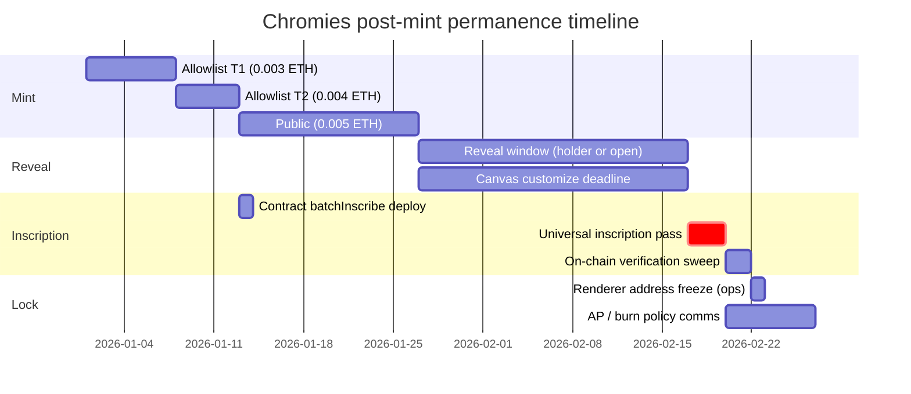

# Universal Inscription & Pricing Change Analysis

**Generated:** 2026-07-07  
**Scope:** Decision support only — **no contract changes in this document.**  
**Context:** Mint tiers move to **0.003 / 0.004 / 0.005 ETH**; project may **universally inscribe all 5,150 tokens** post-reveal at subsidized gas.

---

## Executive summary

| Topic | Finding |
|-------|---------|
| **Inscription lock today** | One-way: SSTORE2 pixel+trait write, `locked[tokenId]=true`, canvas diffs baked and cleared, `revealedTraits` deleted. No unlock, no re-inscribe. |
| **Burn-into-locked** | **Reverts today** (`ChromaCanvasV2.TokenLocked` on receiver). If **all** tokens are inscribed, **all** `revealBurnAndApplyDiff` calls revert — the primary AP-earning loop stops. |
| **Universal inscription (as-is)** | `inscribe()` requires `msg.sender == ownerOf(tokenId)`. Project **cannot** inscribe holder tokens without a **contract change** (operator path) or holders executing txs. |
| **Batch inscribe (as-is)** | **No batch function.** ~554k gas/inscribe × 5,150 ≈ **2.85B gas** execution-only; ~**103–129 txs** if a future batch fn packs ~40–50 tokens/tx under 30M block limit. |
| **Pricing change** | Live `Chroma.sol` constants are **0.0025 / 0.0035 / 0.0045 ETH** — requires **redeploy** to reach **0.003 / 0.004 / 0.005**. Repo has three conflicting price sets (see §4). |
| **Max gross uplift** | +**2.475 ETH** vs current constants (at full sellout). Inscription pass at 1 gwei (reveal+inscribe) ≈ **3.15 ETH** — exceeds uplift at low gas; at 5 gwei ≈ **15.8 ETH**. |

---

## 1. Burn-into-locked audit

### 1.1 Three token lifecycle states (on-chain)

| State | Flags | `tokenURI` source | Canvas pixel edits |
|-------|-------|-------------------|-------------------|
| **Unrevealed** | `revealed=false` | Placeholder data-URI (`_unrevealedURI`) | Blocked (not revealed) |
| **Revealed** | `revealed=true`, `hasData=false` | Off-chain `revealedBaseURI + id + ".json"` | Allowed (`applyDiff`) |
| **Inscribed** | `revealed=true`, `hasData=true`, `locked=true` | On-chain `renderer.tokenURI` (~3.0M gas read, Pass B.1) | **Blocked** |

Frontend mirrors this: `inscribed = revealed && hasData` (`src/lib/chroma-ownership.js`).

### 1.2 What `inscribe()` locks (contract-level)

**Entry:** `Chroma.inscribe` — `contracts/Chroma.sol:137–156`

| Step | Effect | Reversible? |
|------|--------|:-----------:|
| Merkle verify | Leaf `keccak256(abi.encode(tokenId, pixels, traits))` vs `revealRoot` | — |
| `locked[tokenId] = true` | Permanent flag; exposed via `isLocked()` | **No** |
| `chromaStorage.writeTokenData` | SSTORE2 pixels (2048 B) + traits (32 B); sets `totalPixels` | **No** (`TokenAlreadyWritten`) |
| `delete revealedTraits[tokenId]` | Off-chain trait snapshot removed | **No** |
| `_bakeCanvasEdits(tokenId)` | If canvas has diffs: composite → `rewritePixels` (updates trait bytes `[17–18]` only) → `clearDiffs` | **No** (baked into SSTORE2) |

**Payload constants:** `PIXELS_LENGTH = 2048`, `TRAITS_LENGTH = 32` (`Chroma.sol:55–56`).

**What is NOT locked by inscription:**

| Capability | Blocked when inscribed? | Evidence |
|------------|:-------------------------:|----------|
| ERC721 transfer | No | No lock hook on `transferFrom` |
| `spendAP` | **No** | `ChromaCanvasV2.spendAP` — owner check only (`:128–131`) |
| `transferAP` / marketplace AP sale | **No** | No `isLocked` gate (`:102–112`, `PixelMarketplace`) |
| `earnAP` (owner admin) | **No** | `onlyOwner` grant (`:120–124`) |
| Burn **as sacrifice** (`burnedTokenId`) | **No** | Sacrifice sent to `DEAD_ADDRESS` before receiver lock check |
| Burn **into** receiver (`tokenId`) | **Yes** | `if (chroma.isLocked(tokenId)) revert TokenLocked()` (`:168`) |
| `applyDiff` / diff in burn tx | **Yes** | `_applyDiff` → `TokenLocked` (`:307`) |
| Re-inscribe / trait mutation | **Yes** | `AlreadyLocked`, `AlreadyInscribed`, `TokenAlreadyWritten` |
| `revealedTraits` read path | N/A | Deleted on inscribe; renderer reads SSTORE2 |

**Stale docs warning:** `docs/chromies-contracts.md` documents `shiftMutationTier` / `updateTrait` — **not present** in live `contracts/*.sol`. Journal mutation-tier AP costs (500 / 1,500 / 5,000) are design notes only.

### 1.3 Burn + AP interaction matrix (inscribed tokens)

**Primary burn path:** `ChromaCanvasV2.revealBurnAndApplyDiff` (`:151–173`)

```
submitCommit → revealBurnAndApplyDiff(receiver, sacrifice, salt, diffData)
  1. sacrifice → DEAD_ADDRESS
  2. burnYield = calculateBurnAP(sacrifice) → _earnAP(receiver)
  3. burnCount[receiver]++
  4. if isLocked(receiver) → REVERT (entire tx, including sacrifice)
  5. optional _applyDiff(receiver)
```

**`calculateBurnAP` pixel source** (`:221–237`, `_sacrificePixelCount :270–280`):

| Sacrifice state | Pixel count used |
|-----------------|------------------|
| Inscribed | `chromaStorage.getTotalPixels(burnedTokenId)` |
| Revealed only | `revealedTraits` bytes `[17–18]` |
| Unrevealed | 0 → 0 AP |

**Yield tiers (unchanged by inscription):** `<1500 px → 1%`, `1500–1999 → 2%`, `≥2000 → 3%`, cap **4%** (`TIER1/2_THRESHOLD`, `MAX_BURN_PERCENT`).

| Scenario | Inscribed sacrifice | Inscribed receiver | Result |
|----------|:-------------------:|:------------------:|--------|
| Burn A into B (both holder-owned) | — | B locked | **Revert** `TokenLocked` |
| Burn inscribed A into revealed B | OK (AP from on-chain pixels) | B unlocked | **OK** — AP credited, optional diff |
| Burn revealed A into inscribed B | OK | B locked | **Revert** |
| After **universal inscription** (all locked) | any | any receiver | **All burn txs revert** at step 4 |

**Secondary paths:**

| Path | Inscription awareness |
|------|----------------------|
| `spendAP` | None — inscribed tokens can spend AP (levels up `totalApSpent` / `level()`) |
| `PixelMarketplace.list/buy` | None — AP trades token-to-token on inscribed NFTs |
| `ChromaRenderer._statusAttribute` | Adds `"Status": "Inscribed"` when `isLocked` |

**Frontend:** `Burn.jsx` has **no** `isLocked` pre-check (on-chain revert only). `Canvas.jsx` blocks paint when `isTokenLocked`. `Inscribe.jsx` / `FAQ.jsx` document permanence.

**Parked product decision** (`SESSION_HANDOFF.md`): *“Burn-into-locked — whether burns can target already-inscribed tokens.”* **Current code: disallowed.**

### 1.4 Options if all 5,150 tokens are inscribed

Document only — no recommendation.

#### Option A — **Keep burn-into-locked revert (status quo)**

| Pros | Cons |
|------|------|
| Inscribed = fully frozen canvas; clear “permanence” story | **Entire burn→AP loop dead** once all inscribed |
| No contract change | Holders with inscribed Chromies cannot absorb sacrifices for AP |
| | `spendAP` + marketplace still work; earned AP from pre-inscribe era only |
| | Gameplay narrative shifts to “pre-inscribe burn window” only |

#### Option B — **Allow burn-into-locked (remove or gate `TokenLocked` on receiver)**

| Pros | Cons |
|------|------|
| AP economy survives post-universal inscription | Inscribed tokens accumulate AP with **no outlet** (`applyDiff` still blocked) |
| Sacrifice burns remain meaningful | Asymmetric: can burn **into** inscribed but not **edit** inscribed |
| Contract change: delete or `if (!allowBurnIntoLocked)` guard | May confuse “locked = done” UX unless copy updated |
| | `burnCount` / `getLevel` rise without canvas expression |

Possible sub-variants:
- **B1:** Credit AP only, never apply diff (current diff path already blocked separately).
- **B2:** Allow diff on inscribed (effectively **un-locks canvas** — contradicts inscription promise unless scoped).

#### Option C — **Re-inscribe-on-change (new expensive path)**

| Pros | Cons |
|------|------|
| Could allow post-inscribe mutation with explicit holder opt-in + gas | **Major contract work**: new fn, new merkle epoch or override root, SSTORE2 rewrite rules |
| Holder pays ~554k+ gas per change | Conflicts with “inscribe once, forever” marketing |
| | Canvas bake + merkle proof pipeline for **edited** state |

Not implementable without new `inscribe` / `rewrite` semantics; today `writeTokenData` is one-shot.

#### Option D — **Restrict / wind down AP economy after universal inscription**

| Pros | Cons |
|------|------|
| Aligns product with “art locked, collection complete” | Requires communication + UI deprecation (Burn, Canvas spend) |
| No burn-into-locked change needed if burns are discouraged | Marketplace AP listings may become low-utility |
| Could freeze `earnAP` admin and document “legacy AP” | Holders with banked AP may feel stranded unless spend paths remain |

#### Option E — **Phased inscription (not universal)**

| Pros | Cons |
|------|------|
| Preserves burn window for un-inscribed receivers | Not the stated “universal” plan |
| Holders choose when to lock | Metadata split (IPFS vs on-chain) until they inscribe |

---

## 2. Batch-inscribe design

### 2.1 Current on-chain surface

| Capability | Status |
|------------|--------|
| `Chroma.inscribe(tokenId, pixels, traits, proof)` | Single token; **caller must be owner** (`:141`) |
| `Chroma.reveal(...)` | Single token; `_requireOwned` (existence check only in OZ ERC721 v5 — **not owner-gated**) |
| Owner `mint(to, tokenId)` | Team reserve path (`:98–104`) |
| Batch inscribe | **Does not exist** |
| Operator / relayer inscribe | **Does not exist** |

**Implication:** “Project performs universal inscription” requires **new contract logic** (e.g. `inscribeWithApproval`, `onlyOwner batchInscribe` with `isApprovedForAll`) **or** 5,150 holder-signed transactions.

**Existing loop reference:** `script/SepoliaMintDryRun.s.sol` — sequential `inscribe` in a loop (deploy script, not a batched on-chain entrypoint).

### 2.2 Measured gas (local Foundry, production merkle depth)

Source: `test/GasStressProfile.t.sol` → `chromies-engine/reports/GAS_STRESS_REPORT.md`

| Operation | Gas | Notes |
|-----------|----:|-------|
| `inscribe_min` | **553,819** | Plain payload, no canvas diffs |
| `inscribe_mean_5_samples` | **553,837** | Tokens 1–5 production leaves |
| `inscribe_max` | **553,849** | |
| `reveal_production_depth_single` | **58,265** | Per token if not yet revealed |
| `tokenURI` (inscribed, Pass B.1) | **~3,021–3,025k** | Alchemy `estimateGas` on Sepolia tokens 1–5 |

**UI copy** (`src/lib/chroma-gas-copy.js`): `~584k gas` / `~$10–13` inscribe at 15–20 gwei — slightly conservative vs Foundry mean.

**Caveat:** Inscribe with **canvas diffs** (`_bakeCanvasEdits` → `computeFinalPixels`) adds variable gas not captured in the plain 5-sample profile. Universal pass immediately post-reveal (no edits) should track ~554k; delayed pass after holder customization trends higher.

### 2.3 Tokens per tx vs block gas limit

**Assumptions:** Ethereum mainnet block gas limit **30,000,000**; target **90%** usable (**27,000,000**) for safety; per-inscribe execution **554,000** gas (mean).

| Mode | Gas budget / tx | Tokens / tx | Calldata note |
|------|----------------:|------------:|---------------|
| **Today (1 inscribe / tx)** | ~554k + 21k base | **1** | ~2.5 KB calldata (2048+32+proof) |
| **Hypothetical batch (execution only)** | 27M | **~48** | `floor(27M / 554k)` |
| **Conservative batch** | 27M | **~40** | Leave headroom for loop overhead + occasional bake |

**Calldata sizing (per token):** 2048 + 32 + (13 × 32) merkle proof ≈ **2.5 KB** for 5,150-leaf tree (depth 13).

| Batch size | Approx. calldata | Risk |
|----------:|-----------------:|------|
| 40 | ~100 KB | Within typical tx limits |
| 50 | ~125 KB | Approaching practical wallet/RPC caps |
| 48 | ~120 KB | Upper bound for single tx |

**Transaction count for 5,150 tokens (hypothetical batch fn):**

| Batch size | Txs required |
|----------:|-------------:|
| 40 | **129** |
| 48 | **108** |
| 1 (status quo) | **5,150** |

### 2.4 Total gas — 5,150 collection

| Phase | Gas / token | Total gas (5,150) |
|-------|------------:|------------------:|
| **Inscribe only** | 553,837 | **2,852,260,550** (~2.85B) |
| **Reveal + inscribe** | 612,102 | **3,152,325,300** (~3.15B) |
| **Amortized inscribe gas / holder** | 553,837 | — |

**ETH cost bands (execution gas only, no priority fees):**

Formula: `ETH = total_gas × gwei × 1e-9`

#### Inscribe only (~2.852B gas)

| Gwei | Total ETH | Per token (ETH) | Per token (@ $3,000/ETH) |
|-----:|----------:|----------------:|-------------------------:|
| **0.3** | 0.856 | 0.000166 | ~$0.50 |
| **0.5** | 1.426 | 0.000277 | ~$0.83 |
| **1.0** | 2.852 | 0.000554 | ~$1.66 |
| **2.0** | 5.704 | 0.001108 | ~$3.32 |
| **5.0** | 14.260 | 0.002769 | ~$8.31 |

#### Reveal + inscribe (~3.152B gas) — if project reveals all un-revealed tokens

| Gwei | Total ETH | Per token (ETH) |
|-----:|----------:|----------------:|
| **0.3** | 0.946 | 0.000184 |
| **0.5** | 1.576 | 0.000306 |
| **1.0** | 3.152 | 0.000612 |
| **2.0** | 6.304 | 0.001224 |
| **5.0** | 15.760 | 0.003061 |

**Cross-check vs holder-paid model:** At 15 gwei self-inscribe, GAS_STRESS_REPORT projects **~$8.31/token** — universal pass at 1 gwei saves ~**15×** on inscription execution.

### 2.5 Execution-window strategy (operational)

| Phase | Goal | Suggested approach |
|-------|------|-------------------|
| **Pre-pass** | Proof inventory | `bridge-mint-data.js` + merkle proofs for all 5,150; verify leaves match `revealRoot` |
| **Reveal window** | Maximize `revealed` before pass | Holder `reveal()` (~58k gas each) **or** permissionless reveal (any payer) if policy allows |
| **Freeze canvas** | Avoid bake surprises | Communicate cutoff for `applyDiff` before pass; un-baked diffs are baked at inscribe |
| **Inscription pass** | Minimize total ETH | Target **low-gwei window** (weekend nights, low base fee); optional private relay / Flashbots |
| **Batching** | Fewer txs | Ship `batchInscribe` in Chroma **before** mainnet if pass is owner-operated |
| **Operator model** | Legal inscribe on holder tokens | Holders `setApprovalForAll(projectOperator, true)` during window **or** new `onlyOwner` batch with per-token EIP-712 consent |
| **Verification** | No silent failures | Script: `hasData(id)` for all IDs; spot `tokenURI` + parity vs `mint-data`; reuse `sepolia_tokenuri_money_test` pattern |
| **Post-pass** | Renderer stability | Optional **renderer lock** policy: stop `setRenderer` after verification (operational, not on-chain today) |

**Throughput (status quo, 1 tx/inscribe):** At 1 tx/block, 5,150 blocks ≈ **17 hours** at 12s blocks — impractical. Batch fn or parallel senders across blocks required.

**Team reserve (200 tokens):** Owner can inscribe `4951–5150` directly today without contract changes.

---

## 3. Pricing change inventory

### 3.1 Target vs deployed vs repo drift

| Tier | **Deployed `Chroma.sol`** | **Decision target** | **Journal (locked)** | **Stale `docs/chromies-contracts.md`** |
|------|------------------------:|--------------------:|---------------------:|---------------------------------------:|
| Allowlist 1 | 0.0025 ETH | **0.003 ETH** | 0.003 ETH | 0.003 ETH |
| Allowlist 2 | 0.0035 ETH | **0.004 ETH** | 0.004 ETH | 0.005 ETH |
| Public | 0.0045 ETH | **0.005 ETH** | **0.00525 ETH** | 0.006 ETH |

**Wei targets:** `3e15`, `4e15`, `5e15`.

**No `revealPrice` / `inscribePrice`** — reveal and inscribe are gas-only.

**Constants are `immutable` in deployed bytecode** — price change = **new `Chroma` deploy** (or undeployed local batch). Renderer/storage/canvas can stay if addresses rewired.

### 3.2 Revenue impact (full community sellout)

Supply caps: Tier1 **2,500** + Tier2 **1,000** + Public **1,450** = **4,950** community (+ **200** team reserve at `owner.mint`, no ETH).

| | Tier 1 | Tier 2 | Public | **Total** |
|---|-------:|-------:|-------:|----------:|
| **Current gross** | 6.250 ETH | 3.500 ETH | 6.525 ETH | **16.275 ETH** |
| **Target gross** | 7.500 ETH | 4.000 ETH | 7.250 ETH | **18.750 ETH** |
| **Delta** | +1.250 | +0.500 | +0.725 | **+2.475 ETH** |

Resolve **public = 0.005 vs 0.00525** before deploy (journal ≠ decision target).

### 3.3 File inventory — requires update on price change

#### Contracts (source of truth — redeploy)

| File | Lines | Current | → Target |
|------|-------|---------|----------|
| `contracts/Chroma.sol` | 48–50 | `MINT_PRICE`, `ALLOWLIST_ONE_PRICE`, `ALLOWLIST_TWO_PRICE` | 0.005 / 0.003 / 0.004 ether |

#### Tests — hardcoded literals

| File | Occurrences | Values to replace |
|------|-------------|-------------------|
| `test/Chroma.t.sol` | ~15 lines | 0.0025 → 0.003; 0.0035 → 0.004; 0.0045 → 0.005; 0.009 → 0.010 (2× public) |
| `test/GasStressProfile.t.sol` | ~15 lines | Same mapping |
| `test/GasStressInvariant.t.sol` | ~5 lines | Same mapping |

Tests that call `chroma.MINT_PRICE()` etc. auto-track after redeploy.

#### Forge scripts

| File | Current | → Target |
|------|---------|----------|
| `script/TestMint.s.sol` | 0.006 ether | 0.005 ether |
| `script/TestBurnAndList.s.sol` | 0.006 / 0.018 ether | 0.005 / 0.015 ether |

#### Frontend

| File | Lines | Current | → Target |
|------|-------|---------|----------|
| `src/lib/chroma-contract.js` | 88–91 `MINT_PRICES_ETH` | 0.0025 / 0.0035 / 0.0045 | 0.003 / 0.004 / 0.005 |
| `src/pages/Mint.jsx` | 207–209 | Reads chain via wagmi | Auto after redeploy; fallback is `MINT_PRICES_ETH` |

**Not mint pricing:** `src/pages/Market.jsx` mock listing prices; `src/lib/chroma-gas-copy.js` inscription **gas** copy.

#### Scripts

| File | Note |
|------|------|
| `scripts/diagnose-mint.ts` | Uses `0.003` as “wrong price” — must flip after tier1 = 0.003 |
| `scripts/gas-report-sepolia.ts` | Reads chain — OK |

#### Docs / handoff

| File | Current prices cited |
|------|---------------------|
| `SESSION_HANDOFF.md` | 0.0025 / 0.0035 / 0.0045 |
| `chromies-engine/reports/SEPOLIA_DEPLOY_SCOPE.md` | 0.0025 / 0.0035 / 0.0045 |
| `art-pipeline/chromies-project-journal.md` | 0.003 / 0.004 / **0.00525** + gross @ $1,450 ETH |
| `docs/chromies-contracts.md` | 0.003 / 0.005 / 0.006 (stale generated) |
| `CHECKLIST.md` | Stale wallet caps “2/2/3” vs contract **5/5/5** |

#### Merkle / allowlist (no ETH amounts)

`art-pipeline/generate-merkle.js`, `public/merkle-tier*.json`, `Chroma.merkleRootOne/Two` — tier **membership** only, not pricing.

---

## 4. Sequencing proposal (timeline)

Illustrative mainnet timeline — adjust dates to mint schedule.



### Phase 0 — Pre-mint (contract batch)

- Deploy `Chroma` with **0.003 / 0.004 / 0.005** constants (requires new deploy vs current Sepolia).
- If universal inscription planned: add **`batchInscribe` / operator inscribe** + tests.
- Decide **burn-into-locked** policy **before** inscription pass (§1.4).
- Sepolia dress rehearsal: batch pass on N tokens; `verify_sepolia_wiring` + `tokenURI` money test.

### Phase 1 — Mint (weeks 1–4)

- Phases: Allowlist One → Allowlist Two → Public (`Chroma.Phase`).
- Holders may **reveal early** (cheap) but should understand **canvas cutoff** before universal pass.
- **Do not** universal-inscribe during mint — conflicts with customization window.

### Phase 2 — Reveal window (~3 weeks)

| Actor | Action | Gas bearer |
|-------|--------|------------|
| Holders | `reveal(tokenId, pixels, traits, proof)` | Holder (~58k) or relayer |
| Project | Monitor `revealed(id)` coverage; chase 100% | — |
| Holders | Optional `applyDiff` / burn-for-AP **while receivers still unlocked** | Holder |

**End criteria:** `revealed(tokenId) == true` for all minted IDs (or explicit waiver list).

### Phase 3 — Universal inscription pass (days)

| Step | Detail |
|------|--------|
| 1 | Snapshot: no pending merkle root change (`revealRoot` frozen) |
| 2 | Execute batch inscribe (owner/operator) at target gwei band |
| 3 | Verify `chromaStorage.hasData(id)` ∀ id ∈ [1, totalSupply] |
| 4 | Run parity: `tokenURI` raster vs `mint-data` previews (Sepolia script pattern) |
| 5 | Confirm marketplace metadata resolves (~3M gas `tokenURI` under RPC caps) |

**Cost timing:** Schedule pass when base fee ∈ **[0.3, 1] gwei** if budget-sensitive; avoid **5 gwei** unless urgency dominates (§2.4).

### Phase 4 — Renderer lock (operational)

| Item | Today | Option |
|------|-------|--------|
| `Chroma.setRenderer` | Owner can swap anytime | **Policy:** single mainnet renderer deploy (Pass B.1), no further swaps after verification |
| `tokenURI` | On-chain PNG-in-SVG shell | Already validated Sepolia `0xE6Ed…4DE6` |
| `renderSVG` | API `/chroma/:id/image.svg` | Secondary path; ~14.9M gas — under cap but separate from marketplace metadata |

No on-chain renderer timelock exists; “lock” = **governance / multisig discipline** unless a new `renounceSetRenderer` is added later.

### Phase 5 — Post-inscription policy comms

- Publish final **AP / burn / marketplace** rules given §1.4 choice.
- Update FAQ, `Burn.jsx`, `Canvas.jsx` if burn-into-locked changes.
- If Option A (status quo): document that **burn-for-AP ended** at inscription pass for practical purposes.

---

## 5. Dependency graph

```
Pricing change (Chroma redeploy)
        │
        ├─► Mint UI / tests / scripts (inventory §3.3)
        │
Universal inscription
        │
        ├─► Requires batch or operator contract change (§2.1)
        ├─► Frozen revealRoot + proof corpus
        ├─► Burn-into-locked decision (§1.4) ──► canvas/gameplay copy
        └─► Renderer verified before pass (tokenURI ~3M gas)
```

---

## 6. Open decisions (report only)

| # | Question |
|---|----------|
| 1 | **Burn-into-locked:** Option A (keep revert) vs B (allow AP credit) vs D (wind down)? |
| 2 | **Operator inscribe:** `setApprovalForAll` campaign vs custodial batch vs holder-paid? |
| 3 | **Public price:** 0.005 vs 0.00525 ETH — align journal and contract? |
| 4 | **Canvas cutoff:** Hard deadline before pass vs inscribe-with-bake for late edits? |
| 5 | **Renderer lock:** Policy-only vs future on-chain renounce? |
| 6 | **Chroma redeploy:** Pricing change bundled with batch-inscribe fn vs separate deploys? |

---

## 7. References

| Artifact | Path |
|----------|------|
| Inscribe + lock | `contracts/Chroma.sol` |
| SSTORE2 | `contracts/ChromaStorage.sol` |
| Burn / lock gates | `contracts/ChromaCanvasV2.sol` |
| AP marketplace | `contracts/PixelMarketplace.sol` |
| Inscribe gas profile | `test/GasStressProfile.t.sol`, `chromies-engine/reports/GAS_STRESS_REPORT.md` |
| tokenURI gas (inscribed) | `chromies-engine/generated/sepolia_tokenuri_money_test.json` |
| Sepolia dry-run inscribe loop | `script/SepoliaMintDryRun.s.sol` |
| Parked burn-into-locked | `SESSION_HANDOFF.md` |
| AP economy notes | `art-pipeline/chromies-project-journal.md` |

**Mainnet:** untouched by this analysis. **No contract changes** made.
